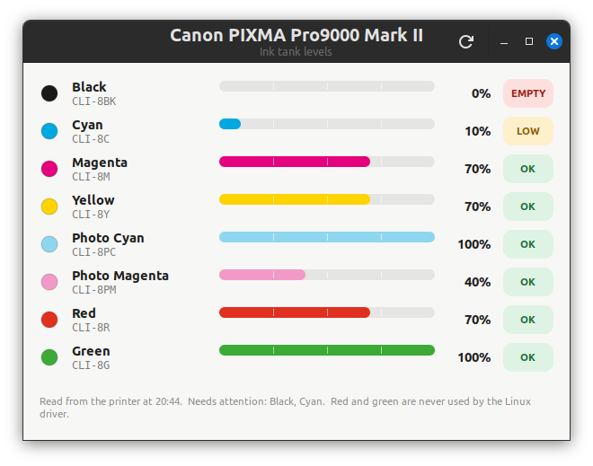

# pro9000-ink

Ink tank levels for the **Canon PIXMA Pro9000 Mark II** on Linux, for all eight tanks:
black, cyan, magenta, yellow, photo cyan, photo magenta, red and green.

Canon never released a Linux driver for this printer, and the usual `ink` /
`libinklevel` tool only decodes six of its eight tanks: the printer reports red and
green, but the library has no entry for them and drops them silently. This tool sends
the printer the same BJL status query and decodes the whole reply itself.

## What you get

- `pro9000-ink-read` - command line reader. `--json` for machine-readable output.
- `pro9000-ink-gui` - a GTK 3 window: colour swatch, tank name and CLI-8 cartridge code,
  a level bar in the ink's colour, and the printer's own OK / LOW / EMPTY flag.
- `pro9000-ink-tray` - a panel icon that is a live eight-bar gauge (see below), polls
  every ten minutes when the printer is idle, and sends a desktop notification when a
  tank turns LOW or EMPTY.

## Install

    ./install.sh

That copies the scripts to `~/.local/bin`, adds a *Pro9000 Ink Levels* launcher to the
menu and Desktop, and registers the tray for autostart.

The reader opens `/dev/usb/lp*`, which is owned by `root:lp`. Either add yourself to the
`lp` group (`sudo usermod -aG lp $USER`, then log out and in) or the tools will fall back
to passwordless `sudo` if you have it.

Requires Python 3, PyGObject (GTK 3), cairo and libnotify - all present on a stock
Linux Mint / Ubuntu desktop.

## How it works

The printer is asked over the USB printer-class interface for its status:

    SSR=BST,SFA,CHD,CIL,CIR,HRI,DBS,DWS,DOC,DSC,DJS,CTK,HCF;

It answers with a `CIR:` block of percentages and a `CTK:` block of per-tank flags:

    CIR:G=100,R=070,LM=040,PBK=000,LC=100,C=010,M=070,Y=070;
    CTK:G,SET,/,R,SET,/,LM,SET,/,PBK,IO,/,LC,SET,/,C,LOW,/,M,SET,/,Y,SET;

`PBK` is this printer's black tank (CLI-8BK), `LC`/`LM` are the photo inks, `IO` means
ink out. The tools refuse to query while a CUPS job is printing, because the query needs
the USB port to itself.

Written against a Pro9000 Mark II. Other Canon models that answer the same query (the
Pro9500 Mark II, and most PIXMAs of that era) will probably work; the tank list is taken
from the reply, not hard-coded.

## Licence

MIT. See `LICENSE`.
